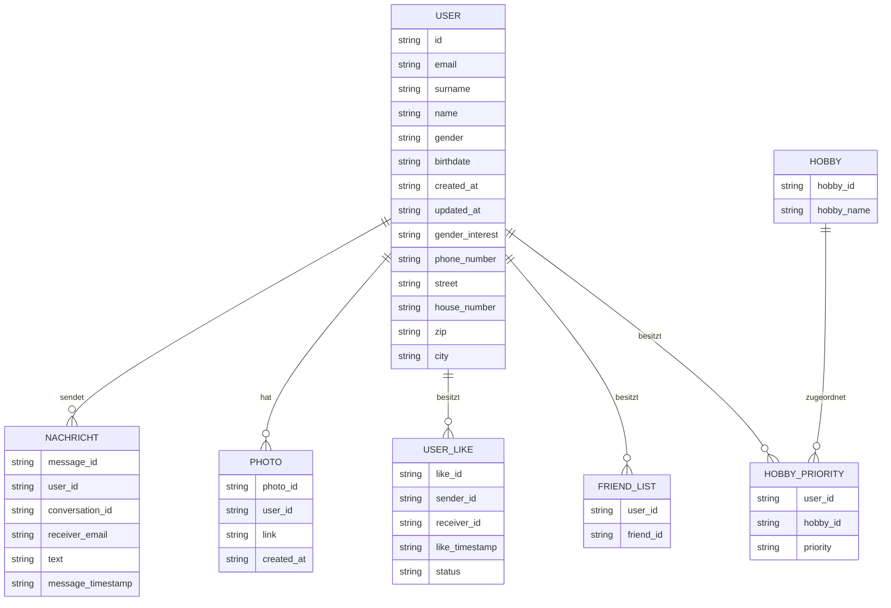

```mermaid
erDiagram
    USER {
        string id
        string email
        string surname
        string name
        string gender
        string birthdate
        string created_at
        string updated_at
        string gender_interest
        string phone_number
        string street
        string house_number
        string zip
        string city
    }

    NACHRICHT {
        string message_id
        string user_id
        string conversation_id
        string receiver_email
        string text
        string message_timestamp
    }

    PHOTO {
        string photo_id
        string user_id
        string link
        string created_at
    }

    USER_LIKE {
        string like_id
        string sender_id
        string receiver_id
        string like_timestamp
        string status
    }

    FRIEND_LIST {
        string user_id
        string friend_id
    }

    HOBBY {
        string hobby_id
        string hobby_name
    }

    HOBBY_PRIORITY {
        string user_id
        string hobby_id
        string priority
    }

    %% Beziehungen (wie in eurem Diagramm)
    USER ||--o{ NACHRICHT : sendet
    USER ||--o{ PHOTO : hat
    USER ||--o{ USER_LIKE : besitzt
    USER ||--o{ FRIEND_LIST : besitzt
    USER ||--o{ HOBBY_PRIORITY : besitzt
    HOBBY ||--o{ HOBBY_PRIORITY : zugeordnet
```
