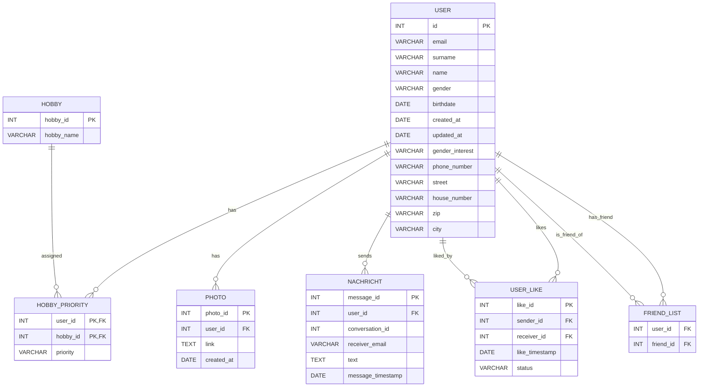

```mermaid
erDiagram
    USER {
        INT     id PK
        VARCHAR email
        VARCHAR surname
        VARCHAR name
        VARCHAR gender
        DATE    birthdate
        DATE    created_at
        DATE    updated_at
        VARCHAR gender_interest
        VARCHAR phone_number
        VARCHAR street
        VARCHAR house_number
        VARCHAR zip
        VARCHAR city
    }

    FRIEND_LIST {
        INT user_id FK
        INT friend_id FK
    }

    NACHRICHT {
        INT     message_id PK
        INT     user_id FK
        INT     conversation_id
        VARCHAR receiver_email
        TEXT    text
        DATE    message_timestamp
    }

    USER_LIKE {
        INT     like_id PK
        INT     sender_id FK
        INT     receiver_id FK
        DATE    like_timestamp
        VARCHAR status
    }

    HOBBY {
        INT     hobby_id PK
        VARCHAR hobby_name
    }

    HOBBY_PRIORITY {
        INT     user_id PK, FK
        INT     hobby_id PK, FK
        VARCHAR priority
    }

    PHOTO {
        INT     photo_id PK
        INT     user_id FK
        TEXT    link
        DATE    created_at
    }

    %% Beziehungen
    USER ||--o{ PHOTO : has
    USER ||--o{ HOBBY_PRIORITY : has
    HOBBY ||--o{ HOBBY_PRIORITY : assigned
    USER ||--o{ NACHRICHT : sends
    USER ||--o{ USER_LIKE : likes
    USER ||--o{ USER_LIKE : liked_by
    USER ||--o{ FRIEND_LIST : has_friend
    USER ||--o{ FRIEND_LIST : is_friend_of
```
