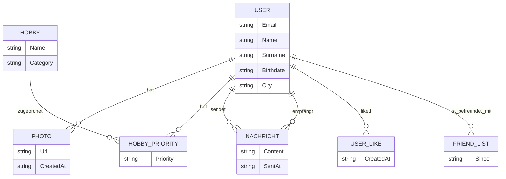

```mermaid
erDiagram
    %% ===== ENTITÄTEN (konzeptionell) =====

    USER {
        string Email
        string Name
        string Surname
        string Birthdate
        string City
    }

    PHOTO {
        string Url
        string CreatedAt
    }

    HOBBY {
        string Name
        string Category
    }

    HOBBY_PRIORITY {
        string Priority
    }

    NACHRICHT {
        string Content
        string SentAt
    }

    USER_LIKE {
        string CreatedAt
    }

    FRIEND_LIST {
        string Since
    }

    %% ===== BEZIEHUNGEN (fachlich) =====
    USER ||--o{ PHOTO : hat
    USER ||--o{ HOBBY_PRIORITY : hat
    HOBBY ||--o{ HOBBY_PRIORITY : zugeordnet

    USER ||--o{ NACHRICHT : sendet
    USER ||--o{ NACHRICHT : empfängt

    USER ||--o{ USER_LIKE : liked
    USER ||--o{ FRIEND_LIST : ist_befreundet_mit
```
