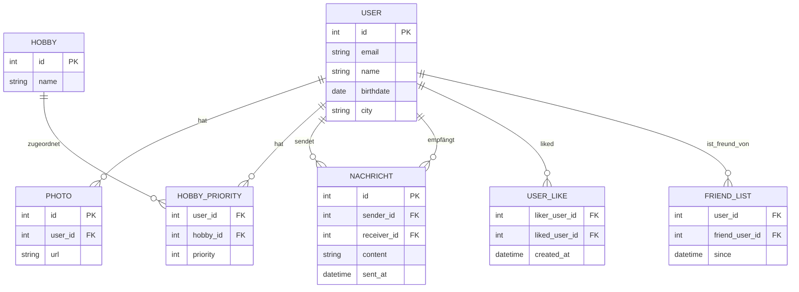

```mermaid
erDiagram
    %% ===== ENTITÄTEN (vereinfacht, logisch) =====

    USER {
        int      id PK
        string   email
        string   name
        date     birthdate
        string   city
    }

    PHOTO {
        int      id PK
        int      user_id FK
        string   url
    }

    HOBBY {
        int      id PK
        string   name
    }

    HOBBY_PRIORITY {
        int      user_id FK
        int      hobby_id FK
        int      priority
    }

    NACHRICHT {
        int      id PK
        int      sender_id FK
        int      receiver_id FK
        string   content
        datetime sent_at
    }

    USER_LIKE {
        int      liker_user_id FK
        int      liked_user_id FK
        datetime created_at
    }

    FRIEND_LIST {
        int      user_id FK
        int      friend_user_id FK
        datetime since
    }

    %% ===== BEZIEHUNGEN =====
    USER ||--o{ PHOTO : hat
    USER ||--o{ HOBBY_PRIORITY : hat
    HOBBY ||--o{ HOBBY_PRIORITY : zugeordnet

    USER ||--o{ NACHRICHT : sendet
    USER ||--o{ NACHRICHT : empfängt

    USER ||--o{ USER_LIKE : liked
    USER ||--o{ FRIEND_LIST : ist_freund_von
```
